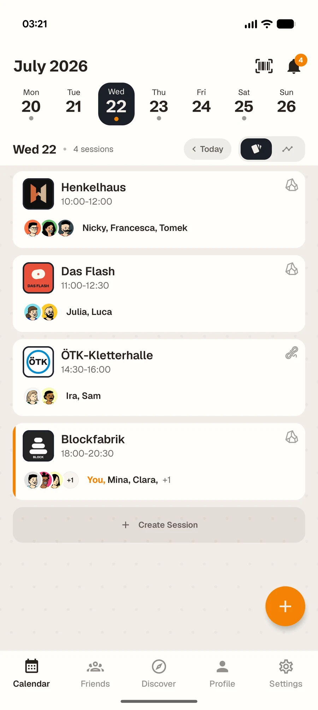
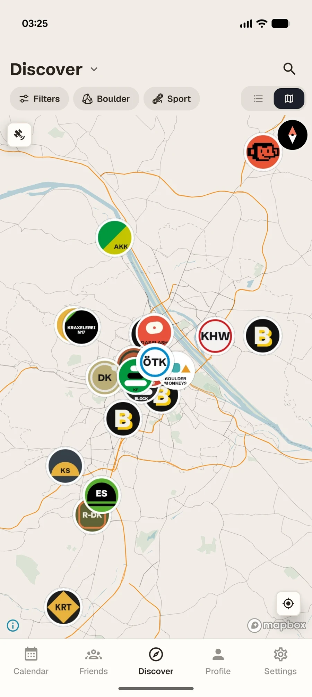
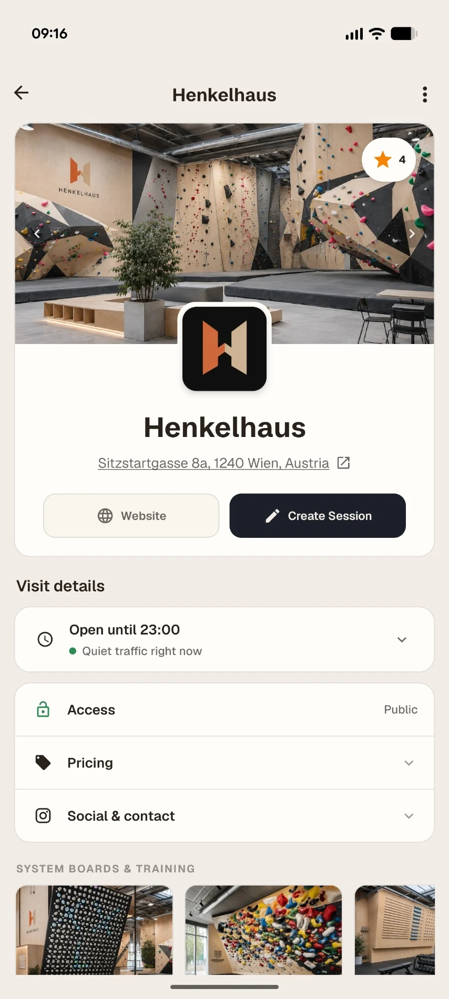
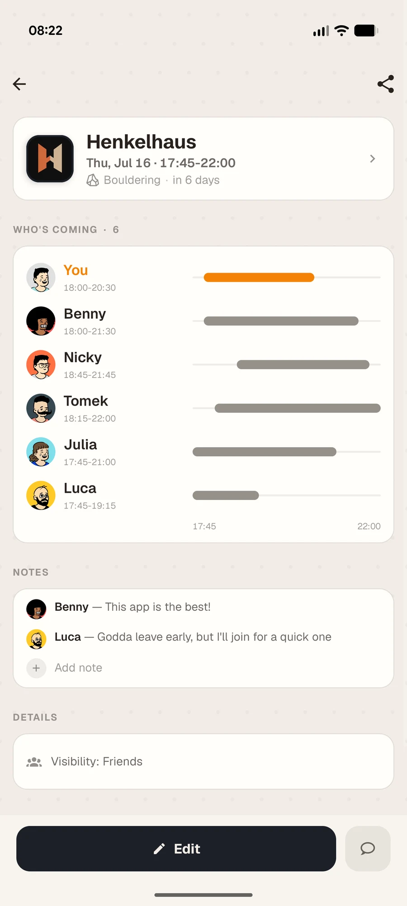
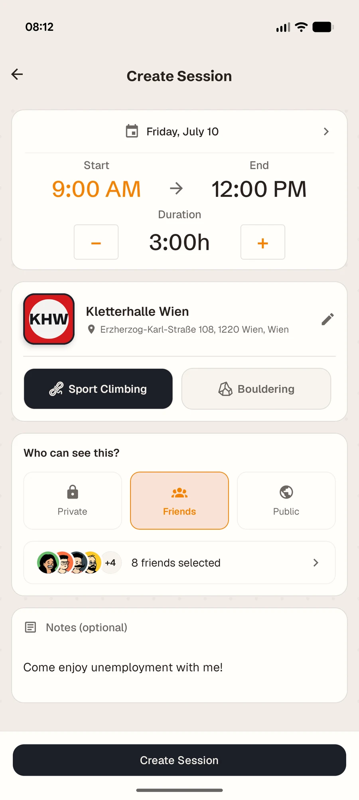
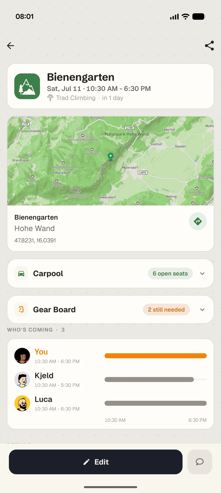
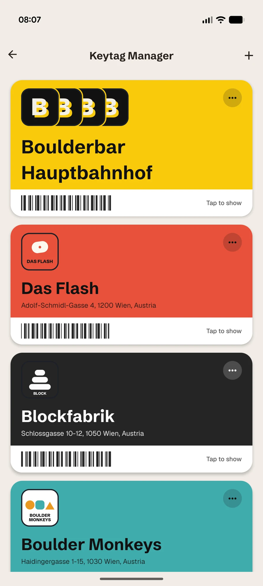

# Hey, I'm Benjamin 👋

I'm building **[ClimbSync](https://climbsync.app)** full time, from Vienna.

### Climb with your friends.

See who's climbing · Join in · Skip the group chat

 

 
 

<picture><source media="(prefers-color-scheme: dark)" srcset="assets/calendar_cards_dark.webp"></picture>
<picture><source media="(prefers-color-scheme: dark)" srcset="assets/discover_map_dark.webp"></picture>
<picture><source media="(prefers-color-scheme: dark)" srcset="assets/gym_details_dark.webp"></picture>

 

## What is ClimbSync?

A place to see when your friends are climbing, instead of digging through a group chat where the plan is buried between a poll, a meme and a "maybe" from Tuesday.

Post that you're going, and it sits quietly in your friends' feeds. They join, say maybe, or ignore it. No one has to answer. When you do need answers, invite specific people or run a poll.

I'd wanted this app for years, so I finally built it. It's a one-person project, bootstrapped, with no investors.

 

<table>
<tr>
<td align="center" width="25%"><picture><source media="(prefers-color-scheme: dark)" srcset="assets/session_details_dark.webp"></picture> <b>See who's in</b> Who's coming, who's a maybe</td>
<td align="center" width="25%"><picture><source media="(prefers-color-scheme: dark)" srcset="assets/create_session_dark.webp"></picture> <b>Plan it your way</b> Post, invite, or poll the group</td>
<td align="center" width="25%"><picture><source media="(prefers-color-scheme: dark)" srcset="assets/outdoor_session_dark.webp"></picture> <b>Take it outside</b> Crag days, carpools, gear</td>
<td align="center" width="25%"><picture><source media="(prefers-color-scheme: dark)" srcset="assets/keytag_manager_dark.webp"></picture> <b>Key tags</b> Leave the plastic fobs at home</td>
</tr>
</table>

 

## How it's built

The app is React Native with Expo, on a Convex backend, with Mapbox for the gym map. The website is Astro. It's in six languages: English, German, Spanish, French, Italian and Chinese. The code lives in a private repo.

 

## Say hi

Climbing in Vienna, or have an idea for ClimbSync? Write to [contact@climbsync.app](mailto:contact@climbsync.app).
